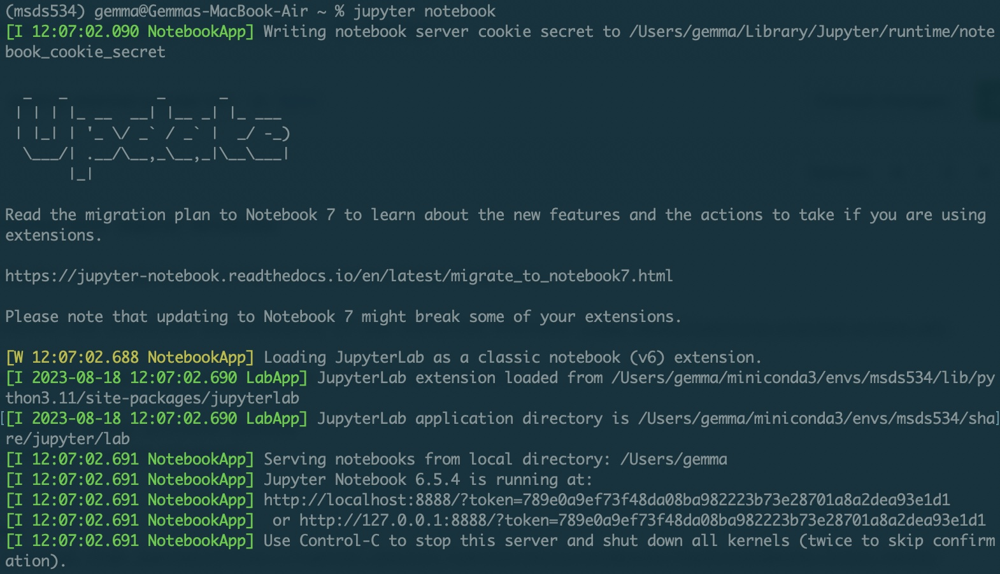
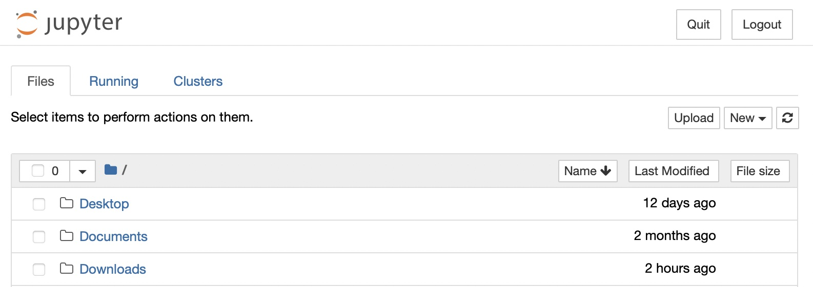

# Getting started with Jupyter Notebooks

Jupyter notebooks are commonly used for interactive Python computing. 

Jupyter notebooks are installed automatically if you installed Anaconda [(see here)](getting-started-python.md).

To use a Jupyter notebook with your `msds534` virtual environment:
1. Open Terminal
2. To be able to use your `msds534` environment for a jupyter notebook, run the command:
```python -m ipykernel install --user --name=msds534```
3. Run the command `jupyter notebook`. In Terminal, you should see output similar to:

Jupyter will automatically open a browser window that looks like this:

4. Navigate to the folder where you want to create a new Jupyter notebook.`
5. In the top right corner of the page, click `New > Notebook: > msds534`.
6. You now have a new Jupyter notebook. See this [example notebook from Jupyter](https://jupyter.org/try-jupyter/retro/notebooks/?path=notebooks/Intro.ipynb) for how they work.
7. To close Jupyter Notebooks, close the browser and type `control+C` in your Terminal.
